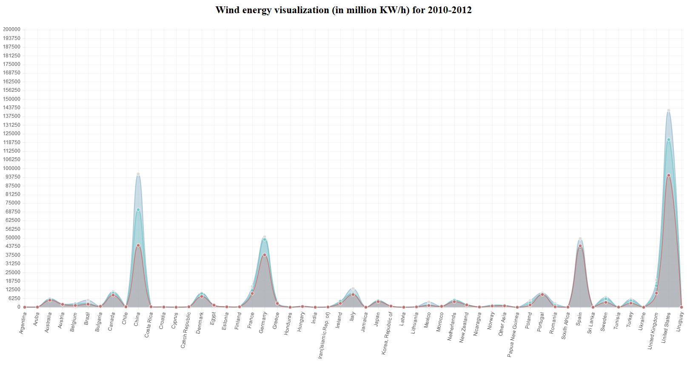

# chartjs
This is an easy to use Python 3.x wrapper of ChartJS to create web based charts from Python scripts. It features the most commonly used functions and supports 6 chart types.

## Sample:
Created by: `python sample.py`

## Usage:
Import the module:

    import chartjs

Create a new chart object with a title, chart type, width and height:

    mychart = chartjs.chart("My test chart", "Bar", 640, 480)

Available chart types include:
* Bar
* Pie
* Doughnut
* PolarArea
* Radar
* Line

Set the labels of the chart:

    mychart.set_labels(["Apple", "Orange", "Banana", "Steak"])

Add a dataset. It must have the same number of values as the number of labels:

    mychart.add_dataset([1, 2.5, 3, 1])

Change some drawing parameters:

    mychart.set_params(fillColor = "rgba(220,220,220,0.5)", strokeColor = "rgba(220,220,220,0.8)", highlightFill = "rgba(220,220,220,0.75)", highlightStroke = "rgba(220,220,220,1)",)

Available parameters include:
* fillColor (color)
* strokeColor (color)
* highlightFill (color)
* highlightStroke (color)
* barValueSpacing (number)
* scaleShowGridLines (True or False)
* pointColor (color)
* pointStrokeColor (color)
* pointHighlightFill (color)
* pointHighlightStroke (color)
* JSinline (True or False)
* scaleBeginAtZero (True or False)

Add another dataset with the new colors:

    mychart.add_dataset([3, 1.2, 0.1, 3])

Note that these colors affect the whole chart for Line, Bar and Radar charts. For Pie, Daughnut and PolarArea, you should set colors and highlights for each value in your data set:  

    mychart.set_colors(['#FA0000', '#008811', '#0055FA', '#559090'])
    mychart.set_highlights(['#FF0000', '#00B851', '#0055FF', '#75B0B0'])

Write out the HTML needed to draw the chart, to be inserted into an existing web page:

    print(mychart.make_chart())

Or, write out a full HTML page with just the chart, that you can save as a .html file to open in a browser:

    print(mychart.make_chart_full_html())

Or, write out a full HTML page including the top HTTP header, perfect if you're using your script as a CGI:

    print(mychart.make_chart_with_headers())
